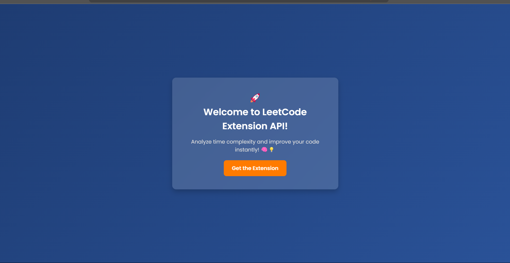

# 🚀 LeetCode Helper Extension

## 🌟 Overview

LeetCode Helper Extension is a powerful browser extension designed to boost your LeetCode coding experience. With just a click, you can:

- 🧠 **Analyze time complexity** of your provided code.
- 📜 **Generate attractive solution content** for your submissions.

This extension is the perfect companion for LeetCode users looking to improve their coding efficiency and showcase their solutions in a well-structured format.

---

## 🖼️ Screenshot



---

## 🎯 Features

✅ **Time Complexity Analysis** - Instantly analyze the time complexity of your provided code and optimize it accordingly.  
✅ **LeetCode Solution Content Generator** - Automatically generate clean and well-formatted solution content for your submissions.  
✅ **User-Friendly Interface** - Simple, intuitive design for seamless integration with LeetCode.  

---

## 🔧 Installation

1️⃣ **Download the Extension**  
   Clone the repository:

   ```bash
   git clone https://github.com/yourusername/leetcode-helper-extension.git
```
2️⃣ **Load the Extension**  
   - Open `chrome://extensions/` in your browser.  
   - Enable **Developer Mode** (top-right toggle).  
   - Click **Load Unpacked** and select the cloned directory.  

---

## 🚀 Usage

1. Open a LeetCode problem.
2. Click on the **LeetCode Helper Extension** icon.
3. Paste your code in the provided field.
4. Click **Analyze Complexity** to get insights.
5. Click **Generate Solution Content** to create an attractive solution format.

---

## 📌 Future Enhancements

🔹 AI-powered suggestions for optimizing time complexity.  
🔹 More formatting options for solution content.  
🔹 Support for multiple programming languages.  

---

## 💖 Contributing

We welcome contributions! Feel free to fork this repository and submit a pull request with your improvements.

---

## ⚖️ License

This project is licensed under the MIT License. See the `LICENSE` file for more details.

---

## ⭐ Show Your Support

If you find this extension useful, don't forget to **star the repository** ⭐ and share it with your fellow coders!

---

📬 **Get in Touch**  
Let's collaborate or chat about tech!  
- 📧 **Email**: [fadaduyash1994@gmail.com](fadaduyash1994@gmail.com)  
- 💼 **LinkedIn**: [Yash - LinkdeIn](https://www.linkedin.com/in/yash-fadadu-aba61327a)  
- 🐙 **GitHub**: [Yash - Github](https://github.com/yashh1994)  
- 📧 **Tweeter**: [Yash - X](https://x.com/yash_fadadu_)  
